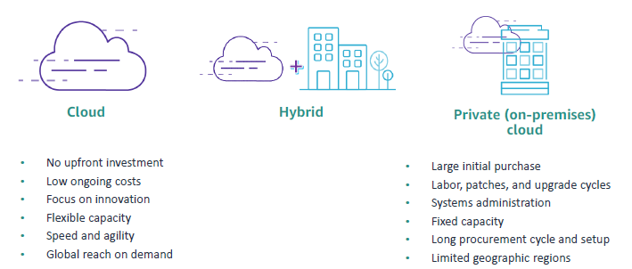

# cloud_foundations 
Dive into foundational knowledge spanning cloud, data science and web development.

### Table of content 
|chapter|Description|
|:-----:|:----------|
|[ch.01](#ch.01)| Introduction to computing |
|[ch.02](#ch.02)| Basic Computing Concepts |
|[ch.03](#ch.03)| Development Team Roles |
|[ch.04](#ch.04)| What is Cloud Computing? |
|[ch.05](#ch.05)| Advantages of Cloud Computing |
|[ch.06](#ch.06)| What is AWS? |
|[ch.07](#ch.07)| Fundamentals of AWS Pricing |
|[ch.08](#ch.08)| AWS Infrastructure Overview |

##  ch. 01 - Introduction to Computing 
------------------[to the top ↑](#top)------------------

*"Technology is not just a tool. It's a part of our lives and shapes our digital world every day."* -Jan Koum, co-founder of WhatsApp.
 
 
In today's world, we can use technology to extend our activities beyond physical, geographical and time limits. 

**Basic computing terminology**
- An application is a set of instructions that runs on a computer to perform a specific task.
- A computer program is written code in a programming language.
- Computer programs are generally called software.

**Type of applications**
*Application run on different types of devices and are accessed in different ways.*
- Web application; Runs in a `web server` or `application server` and is accessed from a web browser
- Mobile app; Runs in and is accessed from a `mobile device`
- Desktop application; Runs in and is accessed from a `desktop computer`
- Internet of Things (IoT) application; Runs in and is accessed from an appliance or `specialized device that is connected to the internet`

**Components inside a computer**
*Hardware*
- Motherboard
- Central Processing Unit (CPU)
- Memory / Random Access Memory (RAM)
- Storage Drive
- Network Card
- Graphic Card
- Power Supply

*Software*
- Operating System (OS)
- Application

In summary, applications, computer and networks run the digital world. An application is a computer program. It is a set of instruction that a computer runs to perform a specific task. A computer's hardware consits of its physical components (as mentioned above) and the software consists of the program that run on it (as mentioned above).

##  ch. 02 - Basic Computing Concepts
------------------[to the top ↑](#top)------------------

#### Servers and data centers

What is a server? A server serves as a specialized computer designed to furnish data or services to other computer across a network. Its fundamental role is to respond to requests initiated by client computers, facilitating seamless communication and data exchange. Distinguished by its hardware specifications, servers typically feature expanded memory capacity and support for multiple CPUs, enabling them to handle substantial workloads efficiently. Moreover, they incorporate redundancy mechanism such as duplicate power supplies and network interfaces to ensure continuous operation. Often compact in design, servers are optimized for rack-mounted deployment in data centers. Examples of servers types span various functions, including web servers for hosting websites, database servers for managing data storage and retrieval, and mail servers for facilitating email communication. These exemplify the divers roles serves fulfill in enabling and enhancing networked computing environments.

Running a web application is an example use case for servers. A web application is typically deployed to a web server, which is responsible for directing client requests to it. A web application usually stores its application data on a database server. The database server runs a special type of software that’s called a database management system (DBMS). The DBMS controls the organization, security, and access of the data.Examples of a DBMS are MySQL, an open-source relational database management system; and Oracle, a relational DBMS that Oracle Corporation owns and offers. The following list shows the flow of information in the example:

1. The user opens a browser on a client machine and enters the address of the web 
application’s homepage. This address is called its home Uniform Resource Locator 
(URL) (for example, https://anycompanywebapp.com).
2. The web server receives the client request and directs it to the appropriate web 
application.
3. The web application sends a request to the database server to access its 
application data.
4. The database server returns the requested data to the web application.
5. The web application builds the response webpage and passes it to the web server, 
which returns the page to the client browser.

**Where does server reside**

Servers reside in a data center. A data center is a physical location that is used to host computer systems and associated components such as networks, storage devices, and power supplies. Data centers are designed to be secure and to provide an ideal climate for the contained equipment to operate. They must protect the equipment from many types of failures and accidents, including power losses and fire.

**Who owns data center**

**Traditional on-premise model**

Traditionally, organizations owned their data centers. The equipment was on premises at a location that the company owned. If you follow this model, you are the one who buys, installs, configures, and manages all the hardware and software in your own facility. You are responsible for installation, maintenance, and numerous other costs. You also must hire the staff who are responsible for the maintenance of the hardware, software, and the facility itself.

**Cloud model**

The cloud model provides another option: a cloud services provider buys the hardware and infrastructure software in their own facility. They manage and maintain it with their own personnel. You bring your application or workload to run on their servers and pay for the services that they offer.

#### Virtual Machine

**What is virtual machine?**

A virtual machine (VM) is a software-based computer.

A virtual machine (VM) is a computer that is emulated through software. It is virtual because it is not a physical computer. Instead, specialized software, which is called virtualization software, runs inside a physical computer to provide the computing capabilities of a VM. In other words, a VM is a software-based computer that runs inside a physical computer.
 
The physical computer where a VM runs is called a host. The VM provides computing capabilities by accessing the physical resources of the host through a software layer, which is called a hypervisor. The hypervisor shares the host’s physical resources—such as its CPU, memory, disk drives, and networking capabilities—among the VMs that run on the host. A VM can run its own operating system, and multiple VMs can run on a single host. With virtualization, you can separate your operating system and applications from the computer’s hardware. Use cases for VMs include virtual desktops, multiple operating support, and cloud computing.

**Benefits of VMs**

1. *Cost Savings*: Running multiple VMs on a single physizal machine reduces the need to buy a new computer.
2. *Efficiency*: Running multiple VMs on a single physical computer increases its utilization.
3. *Reusability and portability*: You can copy a VM image on the same physical host or move it to a different host to duplicate the VM's computing environment.

**VMs in the cloud**

Vms are the fundamental unit of computing in the cloud. that provide the folloning;
1. Self-service.
2. Ability to pay for only what you use.
3. Scalability.

#### Software development life cycle

**How Software is developed**

**Sofware Development Life Cycle (SDLC)**

- **Plan**: What is the problem and what resources do you need to solve it?
The goals of the project are identified along with the resources that are required to implement them. The output of this phase is a *project plan*.
- **Analyze**: What do you want from a solution?
Product requirement are clearly defined and documented in a *software requirement specification (SRS)*.
- **Design**: How will you build what you want?
  Using SRS, different types of architecture are evaluated for the best use in the project. More than one design approach is created and proposed in a *designed specification document*. The *design specification document* contains detailed functional descriptions and other information, such as user interface descriptinos. The design options are reviewed for risk, budget and time constraints. The best design is then selected.
  
- **Develop**: Build what you designed. The actual writing of the computer code happens in this phase, and the product is built.
- **Test**: Did you get what you want? The purpose of the test phase is to validate that the application components function as intended. This phase is also used to uncover and correct defects before the application is released to users. Common type of testing include the following; a) Unit Test, b) Integration Test, c) Security Test, d) Performance Test

 

1. Unit testing tests individual application components at the program level. The programmer usually does this test.
2. Integration testing tests the combination of multiple application components to verify that they work together correctly.
3. Security testing tests to see whether the application is vulnerable from internal or external threats.
4. Performance testing tests to see whether the application meets its expected performance requirements.

- **Implement**: Start to use what you built. Implementation is often called deployment. The customer approves and signs off the completion of the application. The application is released and used in production.
- **Maintain**: Improve what you built. As soon as the application is in production, it must be monitored and maintained. The following are the four general types of application maintenance:

 

1. Corrective maintenance is used to fix a problem that occurs and for which a solution is identified.
2. Adaptive maintenance is required when something in the application’s runtime environment is going to change. For example, an upgrade is planned for the database software that the application uses.
3. Perfective maintenance occurs when new or revised functionality is identified for the application. For example, the user requests a change in the user interface.
4. Preventive maintenance consists of changes that are made to avoid potential issues in the future. For example, code is redesigned or restructured for easier maintenance.

 

To simplify how maintainance works as follows:
1. Defect or error identified → Corrective maintenance.
2. Changes in application environment → Adaptive maintenance.
3. Changes in application requirements → Perfective maintenance.
4. Prevent the occurrence of errors → Preventive maintenance.

##  ch. 03 - Development Team Roles
------------------[to the top ↑](#top)------------------

#### Job titles for development team roles.
| Project Manager | Analyst | Quality Assurance | Software Developer | Database Administrator |

To complete the software development lifecycle (SDLC) in a successful and timely manner, development often takes place in teams. All team members have specialized roles that are designed to collaborate with each other. Many teams are self-contained, where the team has enough technical expertise to accomplish the SDLC without relying on outside support.

##  ch. 04 - What is Cloud Computing?
------------------[to the top ↑](#top)------------------

#### Understanding Cloud Computing
- Cloud computing is the on-demand delivery of compute power, database, storage, applications, and other IT resources.
- These resources are delivered through a cloud services platform through the internet with payas-you-go pricing. In its most basic definition, the cloud is a computer that is located somewhere else, accessed through the internet, and used in some way. Web services is another name for what people call the cloud.

**Cloud Service Models**

- Cloud services fall into one of three primary categories, which are based mainly on how much control and responsibility you have over the service’s configuration. With infrastructure as a service (IaaS), you manage the server, which can be physical or virtual, and the operating system (Microsoft Windows or Linux). In general, the data center provider has no access to your server.
- With platform as a service (PaaS), someone else manages the underlying hardware and operating systems. With this option, you can run applications without managing underlying infrastructure (for example, patching, updates, maintenance, hardware, and operating systems). PaaS also provides a framework for developers that they can build on to create customized applications.
- With software as a service (SaaS), you manage your files while the service provider manages all data centers, servers, networks, storage, maintenance, and patching. You handle only the software and how you want to use it. You are provided with a complete product that the service provider runs and manages. Facebook and Dropbox are examples of SaaS. You manage your Facebook contacts and Dropbox files, and the service providers manage the systems.

**Cloud Service Models: Who Managed What?**

**Cloud Computing Deployment Models**

<b>Cloud (or all-in cloud)</b> is a cloud-based application that is fully deployed in the cloud. All parts of the application run in the cloud. Applications in the cloud were either created in the cloud or migrated from an existing infrastructure. Cloud-based applications can be built on low-level infrastructure pieces (for example, networking, compute, or storage). They can also use higher-level services that provide abstraction from the management, architecting, and scaling requirements of core infrastructure.

A hybrid deployment is a way to connect infrastructure and applications between cloud-based resources and existing resources that are not in the cloud. The most common method of hybrid deployment is between the cloud and existing on-premises infrastructure. On-premises infrastructure is located in the physical confines of an enterprise, often in the company's data center. A hybrid deployment model is used to extend an organization's infrastructure into the cloud while it connects cloud resources to an internal system. For more information about how AWS can help you  with a hybrid deployment, see [Hybrid Cloud](https://aws.amazon.com/hybrid/) with AWS.

When you run a cloud infrastructure from your own data center, it is called a private or on-premises cloud. Although this kind of deployment lacks many of the benefits of cloud computing, it does provide dedicated resources. It’s a popular choice for of cloud computing, it does provide dedicated resources. of cloud computing, it does provide dedicated resources. It’s a popular choice for organizations that must meet certain compliance standards. In most cases, this deployment model is the same as legacy IT infrastructure, but it uses application management and virtualization to increase resource utilization.

**Cloud Infrastructure Compared With On-Premises Infrastructure.**

##  ch. 05 - Advantages of Cloud Computing
------------------[to the top ↑](#top)------------------

**How does cloud computing benefit you?**

Cloud offers servers, storage, and services via internet, freeing device memory with cloud storage for easy accessibility.

**If you have a business, how can cloud computing benefit your business?**

Cloud offers flexible, cost-effective IT resources, eliminating upfront hardware investments and the need for physical infrastructure.

**Why are so many companies interested in moving to the cloud?**

Companies are moving to the cloud because it presents many benefits including cost savings because you pay only for the resources that you use.

**Fixed Expenses & Variable Expenses**
| Fixed Expenses | Variable Expenses |
|:--------------:|:-----------------:|
|Funds that a company uses to acquire, upgrade, and maintain physical assets, such as property, industrial buildings or equipment.|An expense that the person who bears the cost can alter or avoid.| 

**Massive economies of scale**

- Because of aggregate usage from  all customers, AWS can achieve higher economies of scale and pass savings on to customers.
- AwS profit growth --> AWS can reduce costs and increase savings --> customer can get cheaper services.

**Reducing Guessing about capacity**

Cloud reduces guessing about capacity needs, offering flexible resource access, scaling up or down with minimal notice.

**Increased Speed and agility**

Cloud enables rapid resource provisioning, reducing time from weeks to minutes, boosting organizational agility with lower costs.

**No more expenses for running and maintaining data centers**

Cloud computing eliminates data center costs and maintenance, allowing focus on business innovation and customer satisfaction.

**Going global in minutes**

Deploy globally in AWS Regions with minimal clicks, ensuring low latency and superior customer experience.

##  ch. 06 - What is AWS?
------------------[to the top ↑](#top)------------------

**Web Services**

Three models of cloud computing are:
|Infrastructure As A Service|Platform as A Service|Software as A Service|

`IaaS` lets you manage servers and operating systems. Cloud basics: networking, compute, data storage.

`PaaS` manages hardware and OS, enabling application deployment without infrastructure management. Developers build on customizable frameworks.

`SaaS` providers manage data centers, servers, and maintenance, while users focus on software utilization. Examples include Facebook and Dropbox.

**Comparison: On-premises and AWS infrastructure**

**What are web services?**
"A web service is internet-accessible software using XML or JSON for standardized API request and response interactions."

**AWS Services**
AWS is a secure cloud services provider with many providers with many different services that include solutions for the following:

| Analytics | Applications Integration | AR and VR | AWS Cost Management | Blockchain |
|:---------:|:------------------------:|:---------:|:-------------------:|:----------:|
| Business Applications | Compute | Containers | Customer Engagement | Database |
| Developer Tools | End User Computing | Front End Web and Mobile | Game Tech | Internet of Things |
| Machine Learning | Management and Governance | Media Service | Migration and Transfer | Networking and Content Delivery |
| Quantum Technologies | Robotics | Satellite | Security, Identity, and Compliance | Storage |

**Easy Solution Example**

AWS, a secure cloud provider, offers scalable services delivered online, granting on-demand access to compute, storage, network, and more.

For instance, in a database app, customer data sent to Amazon EC2 is batched and stored in Amazon S3. Utilize Amazon DynamoDB for nonrelational database needs, potentially within Amazon VPC for network security.

**Choosing a service**

The service that you select depends on your business goals and technology requirements.

Your choice of service depends on business goals and technology needs. While EC2 was used in the example, AWS offers various compute options:

- [Amazon EC2](https://aws.amazon.com/ec2/) – You want complete control over your AWS computing resources.
- [AWS Lambda](https://aws.amazon.com/lambda/) – You want to run your code and not manage or provision servers.
- [AWS Elastic Beanstalk](https://aws.amazon.com/elasticbeanstalk/) – You want a service that deploys, manages, and scales your web applications for you.
- [Amazon Lightsail](https://aws.amazon.com/lightsail/) – You need a lightweight cloud platform for an easy web application.
- [AWS Batch](https://aws.amazon.com/batch/) – You must run hundreds of thousands of batch workloads.
- [AWS Outposts](https://aws.amazon.com/outposts/) – You want to run AWS infrastructure in your on-premises data center.
- [Amazon Elastic Container Service (Amazon ECS)](https://aws.amazon.com/ecs/), [Amazon Elastic Kubernetes Service (Amazon EKS)](https://aws.amazon.com/eks/), or [AWS Fargate](https://aws.amazon.com/fargate/) – You want to implement a containers or microservices architecture.
- [VMware Cloud on AWS](https://aws.amazon.com/vmware/https://aws.amazon.com/vmware/)– You have an on-premises server virtualization platform that you want to migrate to AWS.premises server virtualization platform that you want to migrate to AWS.

**Commonly Used Services**

| Services | Amazon Services|
|:--------:|:---------------|
| Compute Services: | <ul><li>Amazon EC2</li><li>AWS Lambda</li><li>AWS Elastic Beanstalk</li><li>Amazon EC2 Auto Scaling</li><li>Amazon ECS</li><li>Amazon EKS</li><li>Amazon ECR</li><li>AWS Fargate</li></ul> |
| Storage Services: | <ul><li>Amazon S3</li><li>Amazon S3 Glacier</li><li>Amazon EFS</li><li>Amazon EBS</li></ul> |
| Security, Identity, and Compliance Services:| <ul><li>IAM</li><li>Amazon Cognito</li><li>AWS Shield</li><li>AWS Artifact</li><li>AWS KMS</li></ul> |
| Databases Services: | <ul><li>Amazon RDS</li><li>Amazon DynamoDB</li><li>Amazon Redshift</li><li>Amazon Aurora</li></ul> |
| Networking and Content Delivery Services: | <ul><li>Amazon VPC</li><li>Amazon Route 53</li><li>Amazon CloudFront</li><li>Elastic Load Balancing</li></ul> |
| Management and Governance Services: | <ul><li>Amazon CloudWatch</li><li>AWS Trusted Advisor</li><li>AWS CloudTrail</li><li>AWS Well-Architected Tool</li><li>AWS Auto Scaling</li><li>AWS Command Line Interface</li><li>AWS Config</li><li>AWS Management Console</li><li>AWS Organizations</li></ul><ul><li>Amazon EC2</li><li>AWS Lambda</li><li>AWS Elastic Beanstalk</li><li>Amazon EC2 Auto Scaling</li><li>Amazon ECS</li><li>Amazon EKS</li><li>Amazon ECR</li><li>AWS Fargate</li></ul>  |
| AWS Cost Management Services: | <ul><li>AWS Cost and Usage Report</li><li>AWS Budget</li><li>AWS Cost Explorer</li></ul> |

**Three (3) Ways to interact with AwS**

1. AWS Management Console
• The console includes an easier-to-use graphical interface.
• You can access the console on a [mobile app](https://aws.amazon.com/console/mobile/).

2. AWS Command Line Interface (AWS CLI)
With the [AWS CLI](https://docs.aws.amazon.com/cli/latest/userguide/cli-chapwelcome.html), you have access to services by discrete commands or scripts.

3. AWS Software Development Kits (SDKs)
Access services directly from your code (such as Java, Python, and others).

**AWS Cloud Adoption Framework AWS CAF**

- Guidelines for establishing, developing, and running AWS environments
- Perspectives in planning, creating, managing, and supporting a modern IT service
- Structure for business and IT Teamns to work together.

**Six (6) Core Perspectives**

AWS CAF organizes cloud migration into perspectives: 
business, people, governance `for business`, and platform, security, operations `for technical` aspects.

**AWS Documentation**

**AWS documentation information**
- Find user guides, developer guides, API references, tutorials, and more.
- Technical papers and guides are also available, including these papers, which are recommended reading for
the AWS Cloud Practitioner exam:
  1. Overview of Amazon Web Services
  2. Overview of Architecting for the Cloud: AWS Best Practices
  3. Overview of How AWS Pricing Works
  4. Overview of the Total Cost of (Non) Ownership of Web Applications in the Cloud

##  ch. 07 - Fundamentals of AWS Pricing
------------------[to the top ↑](#top)------------------

**AWS Pricing Model**

Three fundamentals drivers of cost with AwS
|Fundamentals Drivers|Descriptions|
|:------------------:|:----------:|
|Compute| Calculated either by the hour or the second & Varies by instance type.|
|Storage| Charged typicall per GB |
|Data Transfer| Outbound is aggregated and charged, inbound has no charge (with some exceptions) & Charged typically per GB.|

**How do you pay for AwS?**

- Pay for what you use
- Pay less when you reserve
- Pay less when you use more and as AWS grows

For more information about AWS pricing, see How [AWS Pricing](https://d0.awsstatic.com/whitepapers/aws_pricing_overview.pdf) Works

**Pay for what you use**

**Pay less when you reserve**

Reserved instances are available in three (3) options:
1. An all upfront reserved instance (AURI) provides the largest discount.
2. A partial upfront reserved instance (Puri) provides lower discounts
3. A No upfront payment reserved instance (NURI) provides smaller discounts

**Pay less by using more**

Realize volume0based discounts:
- Save more as usage increases
- Services like Amazon Simple Storage Service (Amazon S3), Amazon Elastic Block Store (Amazon EBS) or Amazon Elastic File System (Amazon EFS) have tiered pricing. The more you use, the less you pay per GB.
- Multiple  storage services deliver lower storage costs based on needs.

**Pay less as AWS grows**

• As AWS grows, AWS focuses on lowering the cost of doing business.
• This practice results in AWS passing savings from economies of scale to you.
• Since 2006, AWS has lowered pricing more than 75 times and continues to do so
• Future higher-performing resources replace current resources for no extra charge.

**Custom pricing**

• Meets varying needs through custom pricing
• Is available for high-volume projects with unique requirements

**[AWS Free tier](https://aws.amazon.com/free/?all-free-tier.sort-by=item.additionalFields.SortRank&all-free-tier.sort-order=asc&awsf.Free%20Tier%20Types=*all&awsf.Free%20Tier%20Categories=*all)**

You can use the AWS Free Tier to gaini hands-on experience with the AWS Cloud, products and services at no charge. This tier is available for 1 year to new customers.
1. Sign un for an AWS account
2. Learn with 10 minutes tutorials
3. Start building with AWS

**Services with no charge**
- `Amazon Virtual Private Cloud (Amazon VPC)`: You can provision a logically isolated section of the AWS Cloud where you can launch AWS resources in a virtual network that you define.
- `AWS Elastic Beanstalk`: With this service, you can quickly deploy and manage applications in the AWS Cloud.
- `Amazon EC2 Auto Scaling`: This service automatically adds or removes resources according to conditions that you define. The resources that you are using increase seamlessly during demand spikes to maintain performance and decrease automatically during demand lulls to minimize costs.
- `AWS CloudFormation`:Developers and systems administrators can use this service to create a collection of related AWS resources and provision them in an orderly and predictable fashion.
- `AWS Identity and Access Management (IAM)`: You can use this service to control your users’ access to AWS services and resources.
- `Consolidated Billing`: You can use this billing feature in the AWS Organizations service to consolidate payment for multiple AWS accounts. Consolidated Billing provides the following:
1. One bill for multiple accounts
2. The ability to track each account’s charges
3. The opportunity to decrease charges because of volume pricing discounts from combined usage
4. The ability to consolidate all of your accounts by using Consolidated Billing and get tiered benefits
- `AWS OpsWorks`: You can use this application management service to deploy and operate applications of all shapes and sizes.

**[AWS Pricing Calculator](https://calculator.aws/#/)**

You can use the AWS Pricing Calculator to do the following:
• Estimate monthly costs.
• Identify opportunities to reduce monthly costs.
• Use templates to compare services and deployment models.

**Total Cost of Ownership**

**On-Premises Infrastrusture versus the cloud**
|Traditional Infrastructure|Cloud|
|:------------------------:|:---:|
|Required Equiment to use| Pay for what you use & w/o equipment|
|Facilities Contracts|Self-service infrastructure|
|Required IT resource and administration|With less focus on infra, team can focus on improve time to market|
|The cost of scaling up|Scale up and down with ease|

**Total cost of ownership (TCO) defined**
TCO is a financial estimate to help identify direct and indirect costs of a system. Use TCO to do the following:
• Compare the costs of running an entire infrastructure environment or specific workload on premises as compared to the AWS Cloud.
• Budget and build the business case for moving to the cloud.

**TCO Considerations**

|TCO Considerations|Descriptions|
|:----------------:|:----------:|
|Server Costs|<li>`Hardware`: Server, rack chassis, power distribution units, top-of-rack switches (and maintenance)</li><li>`Software`: Operating system (OS), virtualization licenses (and maintenance)</li><li>`Facilities cost`: Space Power, Cooling</li></ul>|
|Storage costs|<li>`Hardware`: Storage disks, storage area network or fiber channel switches</li><li>Storage administration costs</li><li>`Facilities cost`: Space Power, Cooling</li></ul>|
|Network costs|<li>`Network hardware`: Local area network switches, load balancer bandwidth costs</li><li>Network administration costs</li><li>`Facilities cost`: Space Power, Cooling</li></ul>|
|IT labor costs|Server administration costs|

##  ch. 08 - AWS Infrastructure Overview 
------------------[to the top ↑](#top)------------------

**AWS Global Infrastructure**

The AWS Global Infrastructure is designed and built to deliver a `flexible`, `reliable`, `scalable` and secure cloud computing environment with high-quality global network performance.

for more info, visit [AWS Global Infrastructure](https://aws.amazon.com/about-aws/global-infrastructure/?p=ngi&loc=0) page.

Created by [Lokman Hakim](https://lokmanTech.github.io)
 
*reference: [AWS Documentation](https://docs.aws.amazon.com/)*
