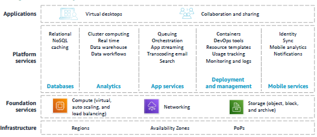
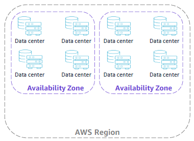
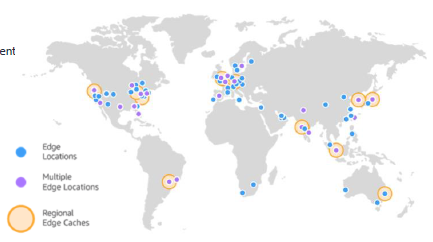
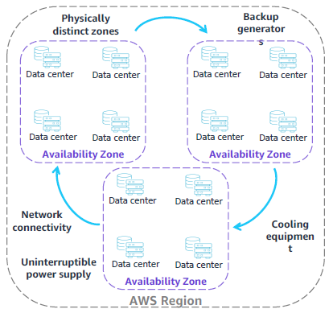
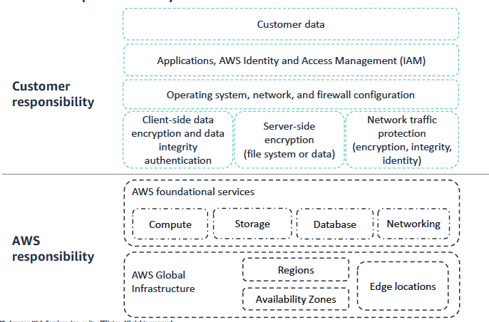
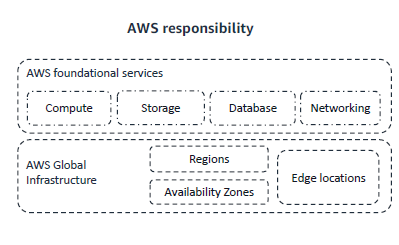
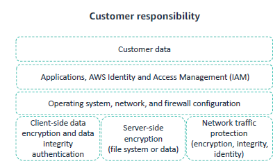

# cloud_foundations 
Dive into foundational knowledge spanning cloud, data science and web development.

### Table of content 
|chapter|Description|
|:-----:|:----------|
|[ch.01](#ch.01)| Introduction to computing |
|[ch.02](#ch.02)| Basic Computing Concepts |
|[ch.03](#ch.03)| Development Team Roles |
|[ch.04](#ch.04)| What is Cloud Computing? |
|[ch.05](#ch.05)| Advantages of Cloud Computing |
|[ch.06](#ch.06)| What is AWS? |
|[ch.07](#ch.07)| Fundamentals of AWS Pricing |
|[ch.08](#ch.08)| AWS Infrastructure Overview |
|[ch.09](#ch.09)| AWS Services and Service Categories |
|[ch.09.1](#ch.09.1)| AWS Services and Service Categories [REVISION] |
|[ch.10](#ch.10)| AWS Shared Responsibility Model |

##  ch. 01 - Introduction to Computing 
------------------[to the top ↑](#top)------------------

*"Technology is not just a tool. It's a part of our lives and shapes our digital world every day."* -Jan Koum, co-founder of WhatsApp.
 
 
In today's world, we can use technology to extend our activities beyond physical, geographical and time limits. 

**Basic computing terminology**
- An application is a set of instructions that runs on a computer to perform a specific task.
- A computer program is written code in a programming language.
- Computer programs are generally called software.

**Type of applications**
*Application run on different types of devices and are accessed in different ways.*
- Web application; Runs in a `web server` or `application server` and is accessed from a web browser
- Mobile app; Runs in and is accessed from a `mobile device`
- Desktop application; Runs in and is accessed from a `desktop computer`
- Internet of Things (IoT) application; Runs in and is accessed from an appliance or `specialized device that is connected to the internet`

**Components inside a computer**
*Hardware*
- Motherboard
- Central Processing Unit (CPU)
- Memory / Random Access Memory (RAM)
- Storage Drive
- Network Card
- Graphic Card
- Power Supply

*Software*
- Operating System (OS)
- Application

In summary, applications, computer and networks run the digital world. An application is a computer program. It is a set of instruction that a computer runs to perform a specific task. A computer's hardware consits of its physical components (as mentioned above) and the software consists of the program that run on it (as mentioned above).

##  ch. 02 - Basic Computing Concepts
------------------[to the top ↑](#top)------------------

#### Servers and data centers

What is a server? A server serves as a specialized computer designed to furnish data or services to other computer across a network. Its fundamental role is to respond to requests initiated by client computers, facilitating seamless communication and data exchange. Distinguished by its hardware specifications, servers typically feature expanded memory capacity and support for multiple CPUs, enabling them to handle substantial workloads efficiently. Moreover, they incorporate redundancy mechanism such as duplicate power supplies and network interfaces to ensure continuous operation. Often compact in design, servers are optimized for rack-mounted deployment in data centers. Examples of servers types span various functions, including web servers for hosting websites, database servers for managing data storage and retrieval, and mail servers for facilitating email communication. These exemplify the divers roles serves fulfill in enabling and enhancing networked computing environments.

Running a web application is an example use case for servers. A web application is typically deployed to a web server, which is responsible for directing client requests to it. A web application usually stores its application data on a database server. The database server runs a special type of software that’s called a database management system (DBMS). The DBMS controls the organization, security, and access of the data.Examples of a DBMS are MySQL, an open-source relational database management system; and Oracle, a relational DBMS that Oracle Corporation owns and offers. The following list shows the flow of information in the example:

1. The user opens a browser on a client machine and enters the address of the web 
application’s homepage. This address is called its home Uniform Resource Locator 
(URL) (for example, https://anycompanywebapp.com).
2. The web server receives the client request and directs it to the appropriate web 
application.
3. The web application sends a request to the database server to access its 
application data.
4. The database server returns the requested data to the web application.
5. The web application builds the response webpage and passes it to the web server, 
which returns the page to the client browser.

**Where does server reside**

Servers reside in a data center. A data center is a physical location that is used to host computer systems and associated components such as networks, storage devices, and power supplies. Data centers are designed to be secure and to provide an ideal climate for the contained equipment to operate. They must protect the equipment from many types of failures and accidents, including power losses and fire.

**Who owns data center**

**Traditional on-premise model**

Traditionally, organizations owned their data centers. The equipment was on premises at a location that the company owned. If you follow this model, you are the one who buys, installs, configures, and manages all the hardware and software in your own facility. You are responsible for installation, maintenance, and numerous other costs. You also must hire the staff who are responsible for the maintenance of the hardware, software, and the facility itself.

**Cloud model**

The cloud model provides another option: a cloud services provider buys the hardware and infrastructure software in their own facility. They manage and maintain it with their own personnel. You bring your application or workload to run on their servers and pay for the services that they offer.

#### Virtual Machine

**What is virtual machine?**

A virtual machine (VM) is a software-based computer.

A virtual machine (VM) is a computer that is emulated through software. It is virtual because it is not a physical computer. Instead, specialized software, which is called virtualization software, runs inside a physical computer to provide the computing capabilities of a VM. In other words, a VM is a software-based computer that runs inside a physical computer.
 
The physical computer where a VM runs is called a host. The VM provides computing capabilities by accessing the physical resources of the host through a software layer, which is called a hypervisor. The hypervisor shares the host’s physical resources—such as its CPU, memory, disk drives, and networking capabilities—among the VMs that run on the host. A VM can run its own operating system, and multiple VMs can run on a single host. With virtualization, you can separate your operating system and applications from the computer’s hardware. Use cases for VMs include virtual desktops, multiple operating support, and cloud computing.

**Benefits of VMs**

1. *Cost Savings*: Running multiple VMs on a single physizal machine reduces the need to buy a new computer.
2. *Efficiency*: Running multiple VMs on a single physical computer increases its utilization.
3. *Reusability and portability*: You can copy a VM image on the same physical host or move it to a different host to duplicate the VM's computing environment.

**VMs in the cloud**

Vms are the fundamental unit of computing in the cloud. that provide the folloning;
1. Self-service.
2. Ability to pay for only what you use.
3. Scalability.

#### Software development life cycle

**How Software is developed**

**Sofware Development Life Cycle (SDLC)**

- **Plan**: What is the problem and what resources do you need to solve it?
The goals of the project are identified along with the resources that are required to implement them. The output of this phase is a *project plan*.
- **Analyze**: What do you want from a solution?
Product requirement are clearly defined and documented in a *software requirement specification (SRS)*.
- **Design**: How will you build what you want?
  Using SRS, different types of architecture are evaluated for the best use in the project. More than one design approach is created and proposed in a *designed specification document*. The *design specification document* contains detailed functional descriptions and other information, such as user interface descriptinos. The design options are reviewed for risk, budget and time constraints. The best design is then selected.
  
- **Develop**: Build what you designed. The actual writing of the computer code happens in this phase, and the product is built.
- **Test**: Did you get what you want? The purpose of the test phase is to validate that the application components function as intended. This phase is also used to uncover and correct defects before the application is released to users. Common type of testing include the following; a) Unit Test, b) Integration Test, c) Security Test, d) Performance Test

 

1. Unit testing tests individual application components at the program level. The programmer usually does this test.
2. Integration testing tests the combination of multiple application components to verify that they work together correctly.
3. Security testing tests to see whether the application is vulnerable from internal or external threats.
4. Performance testing tests to see whether the application meets its expected performance requirements.

- **Implement**: Start to use what you built. Implementation is often called deployment. The customer approves and signs off the completion of the application. The application is released and used in production.
- **Maintain**: Improve what you built. As soon as the application is in production, it must be monitored and maintained. The following are the four general types of application maintenance:

 

1. Corrective maintenance is used to fix a problem that occurs and for which a solution is identified.
2. Adaptive maintenance is required when something in the application’s runtime environment is going to change. For example, an upgrade is planned for the database software that the application uses.
3. Perfective maintenance occurs when new or revised functionality is identified for the application. For example, the user requests a change in the user interface.
4. Preventive maintenance consists of changes that are made to avoid potential issues in the future. For example, code is redesigned or restructured for easier maintenance.

 

To simplify how maintainance works as follows:
1. Defect or error identified → Corrective maintenance.
2. Changes in application environment → Adaptive maintenance.
3. Changes in application requirements → Perfective maintenance.
4. Prevent the occurrence of errors → Preventive maintenance.

##  ch. 03 - Development Team Roles
------------------[to the top ↑](#top)------------------

#### Job titles for development team roles.
| Project Manager | Analyst | Quality Assurance | Software Developer | Database Administrator |

To complete the software development lifecycle (SDLC) in a successful and timely manner, development often takes place in teams. All team members have specialized roles that are designed to collaborate with each other. Many teams are self-contained, where the team has enough technical expertise to accomplish the SDLC without relying on outside support.

##  ch. 04 - What is Cloud Computing?
------------------[to the top ↑](#top)------------------

#### Understanding Cloud Computing
- Cloud computing is the on-demand delivery of compute power, database, storage, applications, and other IT resources.
- These resources are delivered through a cloud services platform through the internet with payas-you-go pricing. In its most basic definition, the cloud is a computer that is located somewhere else, accessed through the internet, and used in some way. Web services is another name for what people call the cloud.

**Cloud Service Models**

- Cloud services fall into one of three primary categories, which are based mainly on how much control and responsibility you have over the service’s configuration. With infrastructure as a service (IaaS), you manage the server, which can be physical or virtual, and the operating system (Microsoft Windows or Linux). In general, the data center provider has no access to your server.
- With platform as a service (PaaS), someone else manages the underlying hardware and operating systems. With this option, you can run applications without managing underlying infrastructure (for example, patching, updates, maintenance, hardware, and operating systems). PaaS also provides a framework for developers that they can build on to create customized applications.
- With software as a service (SaaS), you manage your files while the service provider manages all data centers, servers, networks, storage, maintenance, and patching. You handle only the software and how you want to use it. You are provided with a complete product that the service provider runs and manages. Facebook and Dropbox are examples of SaaS. You manage your Facebook contacts and Dropbox files, and the service providers manage the systems.

**Cloud Service Models: Who Managed What?**

**Cloud Computing Deployment Models**

<b>Cloud (or all-in cloud)</b> is a cloud-based application that is fully deployed in the cloud. All parts of the application run in the cloud. Applications in the cloud were either created in the cloud or migrated from an existing infrastructure. Cloud-based applications can be built on low-level infrastructure pieces (for example, networking, compute, or storage). They can also use higher-level services that provide abstraction from the management, architecting, and scaling requirements of core infrastructure.

A hybrid deployment is a way to connect infrastructure and applications between cloud-based resources and existing resources that are not in the cloud. The most common method of hybrid deployment is between the cloud and existing on-premises infrastructure. On-premises infrastructure is located in the physical confines of an enterprise, often in the company's data center. A hybrid deployment model is used to extend an organization's infrastructure into the cloud while it connects cloud resources to an internal system. For more information about how AWS can help you  with a hybrid deployment, see [Hybrid Cloud](https://aws.amazon.com/hybrid/) with AWS.

When you run a cloud infrastructure from your own data center, it is called a private or on-premises cloud. Although this kind of deployment lacks many of the benefits of cloud computing, it does provide dedicated resources. It’s a popular choice for of cloud computing, it does provide dedicated resources. of cloud computing, it does provide dedicated resources. It’s a popular choice for organizations that must meet certain compliance standards. In most cases, this deployment model is the same as legacy IT infrastructure, but it uses application management and virtualization to increase resource utilization.

**Cloud Infrastructure Compared With On-Premises Infrastructure.**

##  ch. 05 - Advantages of Cloud Computing
------------------[to the top ↑](#top)------------------

**How does cloud computing benefit you?**

Cloud offers servers, storage, and services via internet, freeing device memory with cloud storage for easy accessibility.

**If you have a business, how can cloud computing benefit your business?**

Cloud offers flexible, cost-effective IT resources, eliminating upfront hardware investments and the need for physical infrastructure.

**Why are so many companies interested in moving to the cloud?**

Companies are moving to the cloud because it presents many benefits including cost savings because you pay only for the resources that you use.

**Fixed Expenses & Variable Expenses**
| Fixed Expenses | Variable Expenses |
|:--------------:|:-----------------:|
|Funds that a company uses to acquire, upgrade, and maintain physical assets, such as property, industrial buildings or equipment.|An expense that the person who bears the cost can alter or avoid.| 

**Massive economies of scale**

- Because of aggregate usage from  all customers, AWS can achieve higher economies of scale and pass savings on to customers.
- AwS profit growth --> AWS can reduce costs and increase savings --> customer can get cheaper services.

**Reducing Guessing about capacity**

Cloud reduces guessing about capacity needs, offering flexible resource access, scaling up or down with minimal notice.

**Increased Speed and agility**

Cloud enables rapid resource provisioning, reducing time from weeks to minutes, boosting organizational agility with lower costs.

**No more expenses for running and maintaining data centers**

Cloud computing eliminates data center costs and maintenance, allowing focus on business innovation and customer satisfaction.

**Going global in minutes**

Deploy globally in AWS Regions with minimal clicks, ensuring low latency and superior customer experience.

##  ch. 06 - What is AWS?
------------------[to the top ↑](#top)------------------

**Web Services**

Three models of cloud computing are:
|Infrastructure As A Service|Platform as A Service|Software as A Service|

`IaaS` lets you manage servers and operating systems. Cloud basics: networking, compute, data storage.

`PaaS` manages hardware and OS, enabling application deployment without infrastructure management. Developers build on customizable frameworks.

`SaaS` providers manage data centers, servers, and maintenance, while users focus on software utilization. Examples include Facebook and Dropbox.

**Comparison: On-premises and AWS infrastructure**

**What are web services?**
"A web service is internet-accessible software using XML or JSON for standardized API request and response interactions."

**AWS Services**
AWS is a secure cloud services provider with many providers with many different services that include solutions for the following:

| Analytics | Applications Integration | AR and VR | AWS Cost Management | Blockchain |
|:---------:|:------------------------:|:---------:|:-------------------:|:----------:|
| Business Applications | Compute | Containers | Customer Engagement | Database |
| Developer Tools | End User Computing | Front End Web and Mobile | Game Tech | Internet of Things |
| Machine Learning | Management and Governance | Media Service | Migration and Transfer | Networking and Content Delivery |
| Quantum Technologies | Robotics | Satellite | Security, Identity, and Compliance | Storage |

**Easy Solution Example**

AWS, a secure cloud provider, offers scalable services delivered online, granting on-demand access to compute, storage, network, and more.

For instance, in a database app, customer data sent to Amazon EC2 is batched and stored in Amazon S3. Utilize Amazon DynamoDB for nonrelational database needs, potentially within Amazon VPC for network security.

**Choosing a service**

The service that you select depends on your business goals and technology requirements.

Your choice of service depends on business goals and technology needs. While EC2 was used in the example, AWS offers various compute options:

- [Amazon EC2](https://aws.amazon.com/ec2/) – You want complete control over your AWS computing resources.
- [AWS Lambda](https://aws.amazon.com/lambda/) – You want to run your code and not manage or provision servers.
- [AWS Elastic Beanstalk](https://aws.amazon.com/elasticbeanstalk/) – You want a service that deploys, manages, and scales your web applications for you.
- [Amazon Lightsail](https://aws.amazon.com/lightsail/) – You need a lightweight cloud platform for an easy web application.
- [AWS Batch](https://aws.amazon.com/batch/) – You must run hundreds of thousands of batch workloads.
- [AWS Outposts](https://aws.amazon.com/outposts/) – You want to run AWS infrastructure in your on-premises data center.
- [Amazon Elastic Container Service (Amazon ECS)](https://aws.amazon.com/ecs/), [Amazon Elastic Kubernetes Service (Amazon EKS)](https://aws.amazon.com/eks/), or [AWS Fargate](https://aws.amazon.com/fargate/) – You want to implement a containers or microservices architecture.
- [VMware Cloud on AWS](https://aws.amazon.com/vmware/https://aws.amazon.com/vmware/)– You have an on-premises server virtualization platform that you want to migrate to AWS.premises server virtualization platform that you want to migrate to AWS.

**Commonly Used Services**

| Services | Amazon Services|
|:--------:|:---------------|
| Compute Services: | <ul><li>Amazon EC2</li><li>AWS Lambda</li><li>AWS Elastic Beanstalk</li><li>Amazon EC2 Auto Scaling</li><li>Amazon ECS</li><li>Amazon EKS</li><li>Amazon ECR</li><li>AWS Fargate</li></ul> |
| Storage Services: | <ul><li>Amazon S3</li><li>Amazon S3 Glacier</li><li>Amazon EFS</li><li>Amazon EBS</li></ul> |
| Security, Identity, and Compliance Services:| <ul><li>IAM</li><li>Amazon Cognito</li><li>AWS Shield</li><li>AWS Artifact</li><li>AWS KMS</li></ul> |
| Databases Services: | <ul><li>Amazon RDS</li><li>Amazon DynamoDB</li><li>Amazon Redshift</li><li>Amazon Aurora</li></ul> |
| Networking and Content Delivery Services: | <ul><li>Amazon VPC</li><li>Amazon Route 53</li><li>Amazon CloudFront</li><li>Elastic Load Balancing</li></ul> |
| Management and Governance Services: | <ul><li>Amazon CloudWatch</li><li>AWS Trusted Advisor</li><li>AWS CloudTrail</li><li>AWS Well-Architected Tool</li><li>AWS Auto Scaling</li><li>AWS Command Line Interface</li><li>AWS Config</li><li>AWS Management Console</li><li>AWS Organizations</li></ul><ul><li>Amazon EC2</li><li>AWS Lambda</li><li>AWS Elastic Beanstalk</li><li>Amazon EC2 Auto Scaling</li><li>Amazon ECS</li><li>Amazon EKS</li><li>Amazon ECR</li><li>AWS Fargate</li></ul>  |
| AWS Cost Management Services: | <ul><li>AWS Cost and Usage Report</li><li>AWS Budget</li><li>AWS Cost Explorer</li></ul> |

**Three (3) Ways to interact with AwS**

1. AWS Management Console
• The console includes an easier-to-use graphical interface.
• You can access the console on a [mobile app](https://aws.amazon.com/console/mobile/).

2. AWS Command Line Interface (AWS CLI)
With the [AWS CLI](https://docs.aws.amazon.com/cli/latest/userguide/cli-chapwelcome.html), you have access to services by discrete commands or scripts.

3. AWS Software Development Kits (SDKs)
Access services directly from your code (such as Java, Python, and others).

**AWS Cloud Adoption Framework AWS CAF**

- Guidelines for establishing, developing, and running AWS environments
- Perspectives in planning, creating, managing, and supporting a modern IT service
- Structure for business and IT Teamns to work together.

**Six (6) Core Perspectives**

AWS CAF organizes cloud migration into perspectives: 
business, people, governance `for business`, and platform, security, operations `for technical` aspects.

**AWS Documentation**

**AWS documentation information**
- Find user guides, developer guides, API references, tutorials, and more.
- Technical papers and guides are also available, including these papers, which are recommended reading for
the AWS Cloud Practitioner exam:
  1. Overview of Amazon Web Services
  2. Overview of Architecting for the Cloud: AWS Best Practices
  3. Overview of How AWS Pricing Works
  4. Overview of the Total Cost of (Non) Ownership of Web Applications in the Cloud

##  ch. 07 - Fundamentals of AWS Pricing
------------------[to the top ↑](#top)------------------

**AWS Pricing Model**

Three fundamentals drivers of cost with AwS
|Fundamentals Drivers|Descriptions|
|:------------------:|:----------:|
|Compute| Calculated either by the hour or the second & Varies by instance type.|
|Storage| Charged typicall per GB |
|Data Transfer| Outbound is aggregated and charged, inbound has no charge (with some exceptions) & Charged typically per GB.|

**How do you pay for AwS?**

- Pay for what you use
- Pay less when you reserve
- Pay less when you use more and as AWS grows

For more information about AWS pricing, see How [AWS Pricing](https://d0.awsstatic.com/whitepapers/aws_pricing_overview.pdf) Works

**Pay for what you use**

**Pay less when you reserve**

Reserved instances are available in three (3) options:
1. An all upfront reserved instance (AURI) provides the largest discount.
2. A partial upfront reserved instance (Puri) provides lower discounts
3. A No upfront payment reserved instance (NURI) provides smaller discounts

**Pay less by using more**

Realize volume0based discounts:
- Save more as usage increases
- Services like Amazon Simple Storage Service (Amazon S3), Amazon Elastic Block Store (Amazon EBS) or Amazon Elastic File System (Amazon EFS) have tiered pricing. The more you use, the less you pay per GB.
- Multiple  storage services deliver lower storage costs based on needs.

**Pay less as AWS grows**

• As AWS grows, AWS focuses on lowering the cost of doing business.
• This practice results in AWS passing savings from economies of scale to you.
• Since 2006, AWS has lowered pricing more than 75 times and continues to do so
• Future higher-performing resources replace current resources for no extra charge.

**Custom pricing**

• Meets varying needs through custom pricing
• Is available for high-volume projects with unique requirements

**[AWS Free tier](https://aws.amazon.com/free/?all-free-tier.sort-by=item.additionalFields.SortRank&all-free-tier.sort-order=asc&awsf.Free%20Tier%20Types=*all&awsf.Free%20Tier%20Categories=*all)**

You can use the AWS Free Tier to gaini hands-on experience with the AWS Cloud, products and services at no charge. This tier is available for 1 year to new customers.
1. Sign un for an AWS account
2. Learn with 10 minutes tutorials
3. Start building with AWS

**Services with no charge**
- `Amazon Virtual Private Cloud (Amazon VPC)`: You can provision a logically isolated section of the AWS Cloud where you can launch AWS resources in a virtual network that you define.
- `AWS Elastic Beanstalk`: With this service, you can quickly deploy and manage applications in the AWS Cloud.
- `Amazon EC2 Auto Scaling`: This service automatically adds or removes resources according to conditions that you define. The resources that you are using increase seamlessly during demand spikes to maintain performance and decrease automatically during demand lulls to minimize costs.
- `AWS CloudFormation`:Developers and systems administrators can use this service to create a collection of related AWS resources and provision them in an orderly and predictable fashion.
- `AWS Identity and Access Management (IAM)`: You can use this service to control your users’ access to AWS services and resources.
- `Consolidated Billing`: You can use this billing feature in the AWS Organizations service to consolidate payment for multiple AWS accounts. Consolidated Billing provides the following:
1. One bill for multiple accounts
2. The ability to track each account’s charges
3. The opportunity to decrease charges because of volume pricing discounts from combined usage
4. The ability to consolidate all of your accounts by using Consolidated Billing and get tiered benefits
- `AWS OpsWorks`: You can use this application management service to deploy and operate applications of all shapes and sizes.

**[AWS Pricing Calculator](https://calculator.aws/#/)**

You can use the AWS Pricing Calculator to do the following:
• Estimate monthly costs.
• Identify opportunities to reduce monthly costs.
• Use templates to compare services and deployment models.

**Total Cost of Ownership**

**On-Premises Infrastrusture versus the cloud**
|Traditional Infrastructure|Cloud|
|:------------------------:|:---:|
|Required Equiment to use| Pay for what you use & w/o equipment|
|Facilities Contracts|Self-service infrastructure|
|Required IT resource and administration|With less focus on infra, team can focus on improve time to market|
|The cost of scaling up|Scale up and down with ease|

**Total cost of ownership (TCO) defined**
TCO is a financial estimate to help identify direct and indirect costs of a system. Use TCO to do the following:
• Compare the costs of running an entire infrastructure environment or specific workload on premises as compared to the AWS Cloud.
• Budget and build the business case for moving to the cloud.

**TCO Considerations**

|TCO Considerations|Descriptions|
|:----------------:|:----------:|
|Server Costs|<li>`Hardware`: Server, rack chassis, power distribution units, top-of-rack switches (and maintenance)</li><li>`Software`: Operating system (OS), virtualization licenses (and maintenance)</li><li>`Facilities cost`: Space Power, Cooling</li></ul>|
|Storage costs|<li>`Hardware`: Storage disks, storage area network or fiber channel switches</li><li>Storage administration costs</li><li>`Facilities cost`: Space Power, Cooling</li></ul>|
|Network costs|<li>`Network hardware`: Local area network switches, load balancer bandwidth costs</li><li>Network administration costs</li><li>`Facilities cost`: Space Power, Cooling</li></ul>|
|IT labor costs|Server administration costs|

##  ch. 08 - AWS Infrastructure Overview 
------------------[to the top ↑](#top)------------------

**AWS Global Infrastructure**

The AWS Global Infrastructure is designed and built to deliver a `flexible`, `reliable`, `scalable` and secure cloud computing environment with high-quality global network performance.

for more info, visit [AWS Global Infrastructure](https://aws.amazon.com/about-aws/global-infrastructure/?p=ngi&loc=0) page.

**AWS Global Infrastructure Elements**

Regions, Availability Zones, and PoPs

**[AWS Data Centers](https://aws.amazon.com/compliance/data-center/)**

The Foundation for the AWS infrastructure is the data centers.

Data centers usually have specific characteristic, such as the following:
- They are a location where the actual physical data resides and data processing occurs.
- They house physical servers (typically 50,000 to 80,000 servers)
- They are online. (All data centers are online & Not data center is cold (or not being used)).

Also, data centers contain AWS custom network equipment, such as the following:
- Multi-original design manufacturer (ODM) sourced hardware.
- Amazon custom network protocol stack.

**AWS Availability Zones**
- Each Availability Zone is made up of one or more data centers.
- Availability Zones are designed for fault isolation.
- Availability Zones are interconnected with other Availability Zones by using high-speed private links.
- You choose your Availability Zones.
- AWS recommends replicating across Availability Zones for resiliency.

**AWS Regions**

- An AWS Region is a geographical area.
- Each Region is made up of two or more Availability Zones.
- AWS has 24 Regions worldwide.
- You activate an control data replication across Regions.
- Communication between Region uses AWS backbone network connections infrastructure

AWS Regions, isolated for fault tolerance, contain multiple Availability Zones. Data stored in a Region isn't replicated outside it. Users choose Regions based on compliance and latency needs.

**Selecting a Region**

- Data governance and legal requirements
- Proximity to customers (latency)
- Services available within the Region
- Costs (vary by Region)

Consider factors like data governance, legal requirements, latency reduction, service availability, and cost when choosing AWS Regions for data storage and services to optimize performance and compliance.

Check location latency: [CloudPing](https://www.cloudping.info/)

**Points of presence (PoP)**

AWS provides a global network of 216 PoP locations

- The PoPs consist of 205 edge locations and 11 Regional edge caches.
- PoPs are used with Amazon CloudFront, a global content delivery network (CDN) that delivers content to end users with reduced latency.
- Regional edge caches are used for content with infrequent access.

AWS Point of Presence (PoP) serves users through Amazon CloudFront or Route 53. With 216 PoPs globally, including 205 edge locations and 11 Regional edge caches, it optimizes content delivery and DNS resolution, reducing latency. Regional edge caches complement CloudFront by storing less-accessed content, enhancing performance.

**AWS Infrastructure Features**

|Features|Descriptions|
|:------:|:----------:|
|Elastic and scalable|<ul><li>Elastic infrastructure that dynamic adapts to capacity</li><li>Scalable infrastructure that adjusts to accommodate growth</li></ul>|
|Fault-tolerant|<ul><li>Continues operating properly in the presence of a failure</li><li>Includes built-in redundancy of components</li></ul>|
|Highly available|<ul><li>High level of operational performance with reduced downtime.</li></ul>|

AWS infrastructure revolves around Regions housing multiple isolated Availability Zones (AZs). Each AZ comprises data centers with redundant networking and infrastructure for fault tolerance, elasticity, scalability, and high availability, requiring minimal human intervention for operation.

##  ch. 09 - AWS Services and Service Categories
------------------[to the top ↑](#top)------------------

**AWS Service Categories**

Top Categories and Products

**Storage Service Category**

|**AWS Storage Services**|
|:----------------------:|
|Amazon Simple Storage Service (Amazon S3)|
|Amazon Elastic Block Store (Amazon EBS)|
|Amazon Elastic File System (Amazon EFS)|
|Amazon Simple Storage Service Glacier|

**`Amazon Simple Storage Service (Amazon S3)`** is an object storage service that offers scalability, data availability, security, and performance. Use it to store and protect any amount of data for websites and mobile apps. It is also used for backup and restore, archive, enterprise applications, Internet of Things (IoT) devices, and big data analytics.

**`Amazon Elastic Block Store (Amazon EBS)`** is high-performance block storage that is designed for use with Amazon EC2 for both throughput-intensive and transaction-intensive workloads. It is used for various workloads, such as relational and non-relational databases, enterprise applications, containerized applications, big data analytics engines, file systems, and media workflows.

**`Amazon Elastic File System (Amazon EFS)`** provides a scalable, fully managed elastic Network File System (NFS) file system for AWS Cloud services and on-premises resources. It is built to scale on demand to petabytes, growing and shrinking automatically as you add and remove files. Using Amazon EFS reduces the need to provision and manage capacity to accommodate growth.

**`Amazon Simple Storage Service Glacier`** is a secure, durable, and low-cost Amazon S3 cloud storage class for data archiving and long-term backup. It is designed to deliver 11 9s (99.999999999 percent) of durability and to provide comprehensive security and compliance capabilities to meet stringent regulatory requirements.

|**AWS Compute Services**|
|:----------------------:|
|Amazon Elastic Cloud (Amazon EC2)|
|Amazon EC2 Auto Scaling|
|Amazon Elastic Beanstalk|
|Amazon Lambda|

**`Amazon Elastic Compute Cloud (Amazon EC2)`** provides resizable compute capacity as virtual machines in the cloud.

**`Amazon EC2 Auto Scaling`** gives you the ability to automatically add or remove EC2 instances according to conditions that you define.

**`AWS Elastic Beanstalk`** is a service for deploying and scaling web applications and services. It deploys them on familiar servers such as Apache HTTP Server and Microsoft Internet Information Services (IIS).

**`AWS Lambda`** gives you the ability to run code without provisioning or managing servers. You pay for only the compute time that you consume, so you won’t be charged when your code isn’t running.

|**AWS Containers Services**|
|:----------------------:|
|Amazon Elastic Container Service (Amazon ECS)|
|Amazon Elastic Container Registry (Amazon ECR)|
|Amazon Elastic Kubernetes Service (Amazon EKS)|
|Amazon Fargate|

`Amazon Elastic Container Service (Amazon ECS)` is a highly scalable, high-performance container orchestration service that supports Docker containers.

`Amazon Elastic Container Registry (Amazon ECR)` is a fully managed Docker container registry that facilitates storing, managing, and deploying Docker container images.

`Amazon Elastic Kubernetes Service (Amazon EKS)` facilitates deploying, managing, and scaling containerized applications that use Kubernetes on AWS.

`AWS Fargate` is a compute engine for Amazon ECS that you can use to run
containers without managing servers or clusters.

|**AWS Database Service**|
|:----------------------:|
|Amazon Relational Database Service (Amazon RDS)|
|Amazon Aurora|
|Amazon Redshift|
|Amazon DynamoDB|

`Amazon Relational Database Service (Amazon RDS)` facilitates setting up, operating, and scaling a relational database in the cloud. It provides resizable capacity while automating time-consuming administration tasks, such as hardware provisioning, database setup, patching, and backups.

`Amazon Aurora` is a relational database that is compatible with MySQL and PostgreSQL. It is up to five times faster than standard MySQL databases and three times faster than standard PostgreSQL databases.

`Amazon Redshift` gives you the ability to run analytic queries against petabytes of data that is stored locally in Amazon Redshift. You can also run queries directly against exabytes of data that are stored in Amazon S3. Amazon Redshift delivers fast performance at any scale.

`Amazon DynamoDB` is a key-value and document database that delivers single-digit millisecond performance at any scale with built-in security, backup and restore, and in-memory caching.

|**AWS Networking and Content Delivery**|
|:----------------------:|
|Amazon Virtual Private Cloud (Amazon VPC)|
|Elastic Load Balancing|
|Amazon CloudFront|
|Amazon Transit Gateway|
|Amazon Route 53|
|AWS Direct Connect|
|AWS Client VPN|

`Amazon Virtual Private Cloud (Amazon VPC)` gives you the ability to provision logically isolated sections of the AWS Cloud. 

`Elastic Load Balancing` automatically distributes incoming application traffic across multiple targets, such as Amazon EC2 instances, containers, IP addresses, and Lambda functions.

`Amazon CloudFront` is a fast content delivery network (CDN) service that securely delivers data, videos, applications, and application programming interfaces (APIs) to customers globally. It has low latency and high transfer speeds.

`AWS Transit Gateway` is a service that customers can use to connect their virtual private clouds (VPCs) and their on-premises networks to a single gateway.

`Amazon Route 53` is a scalable, cloud Domain Name System (DNS) web service. It is designed to give you a reliable way to route end users to internet applications. Route 53 translates names (like www.example.com) into the numeric IP addresses (like 192.0.2.1) that computers use to connect to each other.

`AWS Direct Connect` provides a way to establish a dedicated private network connection from your data center or office to AWS. Using AWS Direct Connect can reduce network costs and increase bandwidth throughput.

`AWS Client VPN` provides a secure private tunnel from your network or device to the AWS global network.

|**AWS Security, Identity and Compliance Services**|
|:----------------------:|
|AWS Identity and Access Management (IAM)|
|AWS Organizations|
|Amazon Cognito|
|AWS Artifact|
|AWS Key Management Service (AWS KMS|
|AWS Shield|

`AWS Identity and Access Management (IAM)` gives you the ability to manage access to AWS services and resources securely. By using IAM, you can create and manage AWS users and groups. You can use IAM permissions to allow and deny user and group access to AWS resources.

`AWS Organizations` permits you to restrict what services and actions are allowed in your accounts.

`Amazon Cognito` gives you the ability to add user sign-up, sign-in, and access control to your web and mobile apps.

`AWS Artifact` provides on-demand access to AWS security and compliance reports and select online agreements.

`AWS Key Management Service (AWS KMS)` provides the ability to create and manage keys. You can use AWS KMS to control the use of encryption across a wide range of AWS services and in your applications.

`AWS Shield` is a managed distributed denial of service (DDoS) protection service that safeguards applications running on AWS.

|**AWS Cost Management**|
|:----------------------:|
|AWS Cost and Usage Report|
|AWS Budgets|
|AWS Cost Explorer|

The `AWS Cost and Usage Report` contains the most comprehensive set of AWS cost and usage data available. It includes additional metadata about AWS services, pricing, and reservations.

`AWS Budgets` provides the ability to set custom budgets that alert you when your costs or usage exceeds (or will likely exceed) your budgeted amount.

`AWS Cost Explorer` has an easy-to-use interface that you can use to visualize, understand, and manage your AWS costs and usage over time.

|**AWS Management and Governance**|
|:----------------------:|
|AWS Management Console|
|AWS Config|
|Amazon CloudWatch|
|AWS Auto Scaling|
|AWS Command Line Interface (AWS CLI)|
|AWS Trusted Advisor|
|AWS Well-Architected Tool|
|AWS CloudTrail|

The `AWS Management Console` provides a web-based user interface for accessing your AWS account.

`AWS Config` provides a service that helps you track resource inventory and changes.

`Amazon CloudWatch` gives you the ability to monitor resources and applications.

`AWS Auto Scaling` provides features that you can use to scale multiple resources to meet demand.

`AWS Command Line Interface (AWS CLI)` provides a unified tool to manage AWS services.

`AWS Trusted Advisor` helps you optimize performance and security.

`AWS Well-Architected Tool` provides help in reviewing and improving your workloads.

`AWS CloudTrail` tracks user activity and API usage.

##  ch. 09.1 - AWS Services and Service Categories [REVISION]
------------------[to the top ↑](#top)------------------

|**Analytics**|**Description**|
|:-----------:|:-------------:|
|Amazon Athena|An interactive query service that makes it easy to analyze data directly in Amazon Simple Storage Service (Amazon S3) using standard SQL.| 
|AWS Data Exchange|A service that makes it easy for AWS customers to exchange data in the cloud.|
|Amazon Elastic MapReduce (Amazon EMR)|A managed service that simplifies the processing of large amounts of data using the Hadoop and Spark frameworks.|
|AWS Glue|A serverless data integration service that makes it easy to discover, prepare, move, and integrate data from multiple sources.|
|Amazon Kinesis|A service that collects, analyzes, and reports on data transmission in real time.|
|Amazon Managed Streaming for Apache Kafka (Amazon MSK)|A fully managed service that enables you to build and run applications that use Apache Kafka to process streaming data.|
|Amazon OpenSearch Service|A managed service that makes it easy to deploy, operate, and scale OpenSearch clusters in the AWS Cloud.|
|Amazon QuickSight|A fully managed business intelligence service that delivers easy-to-understand insights to users.|
|Amazon Redshift|A fully managed, petabyte-scale data warehouse service in the AWS Cloud.|

|**Application Integration**|**Description**|
|:-------------------------:|:-------------:|
|Amazon EventBridge|A serverless event bus that uses events to connect application components together.|
|Amazon Simple Notification Service (Amazon SNS)|A web service that coordinates and manages the delivery or sending of messages to subscribing endpoints or clients.|
|Amazon Simple Queue Service (Amazon SQS)|A fully managed message queuing service that enables you to decouple and scale microservices, distributed systems, and serverless applications.|
|AWS Step Functions|A serverless workflow service for coordinating distributed applications and microservices.|

|**Business Application**|**Description**|
|:----------------------:|:-------------:|
|Amazon Connect|A cloud-based omnichannel contact center service.|
|Amazon Simple Email Service(Amazon SES)|An email platform for sending and receiving email using your own email addresses and domains.|

|**Cloud Financial Management**|**Description**|
|:----------------------------:|:-------------:|
|AWS Billing Conductor|Customizes your billing data to match your business logic|
|AWS Budgets|Tracks your costs and usage with custom budgets|
|AWS Cost and Usage Report|Provides comprehensive AWS costs and usage over time|
|AWS Marketplace|A digital catalog for finding, buying, deploying and managing third-party software, data, and services.|

|**Compute**|**Description**|
|:---------:|:-------------:|
|AWS Batch| Runs batch computing workloads on the cloud.|
|Amazon EC2| Provides resizable compute capacity in the cloud.|
|AWS Elastic Beanstalk|Deploys and scales application on AWS|
|Amazon Lightsail|Offers virtual private servers, storage, databases and networking.|
|AWS Local Zones|Extends AWS infrastructure, services, APIs, and tools to virtually any datacenter, co-location space, or on-premises facility.|
|AWS Outposts|Extends AWS infrastructure, AWS services, APIs and tools to virtually any datacenter, co-location space or on-premises facility.|
|Amazon Wavelength|Delivers single-digit millisecond latencies to mobile devices and end-users.|

|**Containers**|**Description**|
|:------------:|:-------------:|
|Amazon Elastic Container Registry (Amazon ECR)|Stores,manages, and deploys Docker container images|
|Amazon Elastic Container Service (Amazon ECS) |A highly scalable, high-performance container orchestration service that supports Docker containers.|
|Amazon Elastic Kubernetes Service (Amazon EKS)| A managed service that makes it easy to run Kubernetes on AWS without needing to install and operate your own Kubernetes control plane.|

|**Customer Engagement**|**Description**|
|:---------------------:|:-------------:|
|AWS Activate for Startups|A program that provides startups with free tools and resources to get started on AWS and grow their business.|
|AWS IQ|Connects you to AWS Certified experts for hands-on help for your AWS projects.|
|AWS Managed Service (Amazon AMS)|A service for managing operations of your AWS infrastructure.|
|AWS Support| Provides a suite of resources, including proactive planning, advisory services, automation tools, communication channels, and 24/7 expert support.|

|**Database**|**Description**|
|:----------:|:-------------:|
|Amazon Aurora| A relational database service that combines the speed and availability of high-end commercial databases with the simplicity and cost-effectiveness of open-source databases.|
|Amazon DynamoDB|A key-value and document database that delivers single-digit millisecond performance at any scale.|
|Amazon MemoryDB for Redis|A Redis-compatible, fully managed, in-memory database service built on reliable and highly available infrastructure managed by AWS.|
|Amazon Neptune|A fast, reliable, fully managed graph database service that makes it easy to build and run applications that work with highly connected datasets.|
|Amazon RDS|Makes it easy to set up, operate, and scale a relational database in the cloud.|

|**Developer Tools**|**Description**|
|:-----------------:|:-------------:|
|AWS AppConfig|A service that enables you to create, manage, and quickly deploy application configurations.|
|AWS CLI| A unified tool that allows you to manage and interact with AWS services using commands in your command-line shell.|
|AWS Cloud9| A cloud-based integrated development environment (IDE) that lets you write, run, and debug your code with just a browser.|
|AWS CodeArtifact| A fully managed artifact repository service that makes it easy for organizations of any size to securely store, publish, and share packages used in their software development process.|
|AWS CodeBuild| A fully managed continuous integration service that compiles source code, runs tests, and produces software packages that are ready to deploy.|
|AWS CodeCommit| A fully managed source control service that hosts secure Git repositories.|
|AWS CodeDeploy| A deployment service that automates application deployments to various compute services such as Amazon EC2 instances, on-premises instances, serverless Lambda functions, or Amazon ECS services|
|AWS CodePipeline| A continuous delivery service that helps you automate your release pipelines for fast and reliable application and infrastructure updates.|
|AWS CodeStar| A cloud-based service for creating, managing, and working with software development projects on AWS.|
|AWS X-Ray| A service that collects data about requests that your application serves, and provides tools that you can use to view, filter, and gain insights into that data to identify issues and opportunities for optimization.|

|**End User Computing**|**Description**|
|:--------------------:|:-------------:|
|Amazon AppStream 2.0| A fully managed, secure application streaming service that allows you to stream desktop applications from AWS to any device running a web browser.|
|Amazon WorkSpaces| A managed, secure Desktop-as-a-Service (DaaS) solution that helps you provision either Windows or Linux desktops in just a few minutes.|
|Amazon WorkSpaces Web| An on-demand, fully managed, Linux-based service designed to facilitate secure browser access to internal websites and software-as-a-service (SaaS) applications.|

|**FrontEnd Web and Mobile**|**Description**|
|:-------------------------:|:-------------:|
|AWS Amplify| A set of tools and services that enables mobile and front-end web developers to build secure, scalable full-stack applications, powered by AWS.|
|AWS AppSync| A fully managed service that makes it easy to develop GraphQL APIs by handling the heavy lifting of securely connecting to data sources like AWS DynamoDB, Lambda, or any HTTP data source.|
|AWS Device Farm| An application testing service that lets you improve the quality of your web and mobile apps by testing them across an extensive range of desktop browsers and real mobile devices.|

|**Internet of Things (IoT)**|**Description**|
|:--------------------------:|:-------------:|
|AWS IoT Core| A managed cloud platform that lets connected devices easily and securely interact with cloud applications and other devices.|
|AWS IoT Greengrass| An Internet of Things (IoT) open-source edge runtime and cloud service that helps you build, deploy, and manage IoT applications on your devices.|

|**Machine Learning**|**Description**|
|:------------------:|:-------------:|
|Amazon Comprehend| A natural language processing (NLP) service that uses machine learning to find insights and relationships in text.|
|Amazon Kendra| A highly accurate and easy-to-use enterprise search service that’s powered by machine learning.|
|Amazon Lex| A service for building conversational interfaces into any application using voice and text.|
|Amazon Polly| A service that turns text into lifelike speech, allowing you to create applications that talk, and build entirely new categories of speech-enabled products.
|Amazon Rekognition| A service that makes it easy to add image and video analysis to your applications.|
|Amazon SageMaker| A fully managed service that provides every developer and data scientist with the ability to build, train, and deploy machine learning (ML) models quickly.|
|Amazon Textract| A service that automatically extracts text and data from scanned documents.|
|Amazon Transcribe| A service that makes it easy for developers to add speech-to-text capability to their applications.|
|Amazon Translate| A neural machine translation service for translating text to and from languages.|

|**Management and Governance**|**Description**|
|:---------------------------:|:-------------:|
|AWS Auto Scaling| A service that monitors your applications and automatically adjusts capacity to maintain steady, predictable performance at the lowest possible cost.|
|AWS CloudFormation| A service that helps you model and set up your AWS resources so you can spend less time managing those resources and more time focusing on your applications that run in AWS.|
|AWS CloudTrail| A service that helps you enable governance, compliance, operational auditing, and risk auditing of your AWS account. Actions taken by a user, role, or an AWS service are recorded as events in CloudTrail.|
|Amazon CloudWatch| A service that monitors your Amazon Web Services (AWS) resources and the applications you run on AWS in real-time. You can use CloudWatch to collect and track metrics, which are variables you can measure for your resources and applications.|
|AWS Compute Optimizer| A machine learning-based service designed to analyze and recommend optimal AWS resources for your workloads. By examining historical utilization metrics, it identifies the best configurations for Amazon EC2 instances, Auto Scaling groups, Amazon EBS volumes, and AWS Lambda functions.|
|AWS Config| A service that provides a detailed view of the configuration of AWS resources in your AWS account. This includes how the resources are related to one another and how they were configured in the past so that you can see how the configurations and relationships change over time.|
|AWS Control Tower| A service that offers a straightforward way to set up and govern a secure, compliant, multi-account AWS environment, following prescriptive best practices.|
|AWS Health Dashboard| An interactive console that gives a real-time overview of the operational status of all your AWS resources. It provides critical information about events that can affect your AWS services, including scheduled maintenance and ongoing operational issues.|
|AWS Launch Wizard| A service that guides you through the sizing, configuration, and deployment of Microsoft SQL Server applications on Amazon, following the Amazon Well-Architected Framework. Amazon Launch Wizard supports both single instance and high availability (HA) application deployments.|
|AWS License Manager| A service that makes it easier for you to manage your software licenses from software vendors (for example, Microsoft, SAP, Oracle, and IBM) centrally across AWS and your on-premises environments.|
|AWS Management Console| A web-based system that allows AWS users to manage different AWS services from a central web interface. Using the AWS Management Console, you can access and configure various AWS services and manage the infrastructure components.|
|AWS Organizations| An AWS account management service that lets users centrally manage and control groups of AWS accounts, and the workflows and policies that apply to them.
|AWS Resource Groups and Tag Editor| AWS Resource Groups make it easy to group your AWS resources using the tags that are assigned to them. You can group resources that share one or more tags. With Tag Editor, you can add tags to—or edit or delete tags of—multiple resources at once.|
|AWS Service Catalog| A service that enables organizations to create and manage catalogs of IT services that are approved for AWS. These IT services can include everything from virtual machine images, servers, software, and databases to complete multi-tier application architectures.|
|AWS Systems Manager| A service in the cloud that provides a consistent process for measuring your architecture using AWS best practices. AWS Systems Manager helps you throughout the product lifecycle by assisting with documenting the decisions you make, providing recommendations for improving your workload based on best practices, and guiding you in making your workloads more reliable, secure, efficient, and cost-effective.|
|AWS Trusted Advisor| A service that provides a set of best practice checks and recommendations to help you reduce costs, increase availability and performance, and improve security. Trusted Advisor inspects your resources across all AWS Regions and presents a summary of check results.|
|AWS Well-Architected Tool| A service in the cloud that provides a consistent process for measuring your architecture using AWS best practices. AWS Well-Architected Tool helps you throughout the product lifecycle by assisting with documenting the decisions you make, providing recommendations for improving your workload based on best practices, and guiding you in making your workloads more reliable, secure, efficient, and cost-effective.|

|**Migration and Transfer**|**Description**|
|:------------------------:|:-------------:|
|AWS Application Discovery Service| A service that collects usage, behavior, and configuration data from on-premises servers to help plan your migration to AWS.|
|AWS Application Migration Service| A highly automated lift-and-shift solution that simplifies, expedites, and reduces the cost of migrating applications to AWS.|
|AWS Database Migration Service (AWS DMS)| A web service that can be used to migrate data from different source data stores to a target data store.|
|AWS Migration Hub| Provides a single place to discover your existing servers, plan migrations, and track the status of each application migration.|
|AWS Schema Conversion Tool (AWS SCT)| A tool that automatically converts the source database schema and most custom code to a format that’s compatible with the target database.|
|AWS Snow Family| A group of devices that transport data in and out of AWS. These devices can transfer up to exabytes of data.|
|AWS Transfer Family| A secure transfer service that enables you to transfer files into and out of AWS storage services.|

|**Networking and Content Delivery**|**Description**|
|:---------------------------------:|:-------------:|
|Amazon API Gateway| A fully managed service that makes it easy for developers to create, publish, maintain, monitor, and secure APIs at any scale.|
|Amazon CloudFront| A content delivery network (CDN) service that helps distribute your static and dynamic content quickly and reliably with high speed performance, security, and developer ease-of-use.|
|AWS Direct Connect| A cloud service solution that provides a more secure, consistent network experience compared to internet-based connections by establishing a private, dedicated network connection from your premises to AWS.|
|AWS Global Accelerator| Improves the availability and performance of your applications with local or global users. It provides static IP addresses that act as a fixed entry point to your application endpoints in a single or multiple AWS Regions.|
|Amazon Route 53| A scalable and highly available Domain Name System (DNS) web service. It is designed to give developers and businesses an extremely reliable and cost-effective way to route end users to Internet applications.|
|Amazon VPC:|Let's you provision a logically isolated section of the AWS Cloud where you can launch AWS resources in a virtual network that you define.|
|AWS VPN| Extends your on-premises networks to the cloud and securely access them from anywhere.|

|**Security, Identity, and Compliance**|**Description**|
|:------------------------------------:|:-------------:|
|AWS Artifact| A service that provides on-demand access to AWS’ security and compliance documents and select online agreements.|
|AWS Audit Manager| A service that helps organizations continuously audit their AWS usage to ensure compliance with internal policies and external regulations.|
|AWS Certificate Manager (ACM)| A service that lets you easily provision, manage, and deploy public and private Secure Sockets Layer/Transport Layer Security (SSL/TLS) certificates for use with AWS services and your internal connected resources.|
|AWS CloudHSM| A cloud-based hardware security module that provides secure cryptographic key storage and operations within a tamper-resistant hardware device.|
|Amazon Cognito| A service that allows AWS customers to manage user access and permissions for their accounts, as well as available APIs/services within AWS.|
|Amazon Detective| A security monitoring service that analyzes and processes Foundational data sources, such as Amazon CloudTrail management events, Amazon CloudTrail event logs, VPC flow logs (from Amazon EC2 instances), and DNS logs.|
|AWS Directory Service| A web service that helps you securely control access to AWS resources. With IAM, you can centrally manage permissions that control which AWS resources users can access.|
AWS Firewall Manager| A security management service that allows you to centrally configure and manage firewall rules across your accounts and applications in AWS Organizations.|
|Amazon GuardDuty| A threat detection service that continuously monitors your AWS accounts and workloads for malicious activity and delivers detailed security findings for visibility and remediation.|
|AWS Identity and Access Management (IAM)| A service that allows AWS customers to manage user access and permissions for their accounts, as well as available APIs/services within AWS.|
|AWS IAM Identity Center (AWS Single Sign-On)| A service that makes it easy to centrally manage SSO access to multiple AWS accounts and business applications.|
|Amazon Inspector| An automated security assessment service that helps improve the security and compliance of applications deployed on AWS.|
|AWS Key Management Service (AWS KMS)| A managed service that makes it easy for you to create and control the encryption keys used to encrypt your data.|
|Amazon Macie| A fully managed data security and data privacy service that uses machine learning and pattern matching to discover and protect your sensitive data in AWS.|
|AWS Network Firewall| A managed service that makes it easy to deploy essential network protections for all of your Amazon Virtual Private Clouds (VPCs).|
|AWS Resource Access Manager (AWS RAM)| A service that enables you to easily and securely share AWS resources with any AWS account or within your AWS Organization.|
|AWS Secrets Manager| Protects access to your applications, services, and IT resources, without the upfront investment and on-going maintenance costs of operating your own infrastructure.|
|AWS Security Hub| Gives you a comprehensive view of your high-priority security alerts and compliance status across AWS accounts.|
|AWS Shield| A managed Distributed Denial of Service (DDoS) protection service that safeguards applications running on AWS.|
|AWS WAF| A web application firewall that helps protect your web applications or APIs against common web exploits that may affect availability, compromise security, or consume excessive resources.|

|**Serverless**|**Description**|
|:------------:|:-------------:|
|AWS Fargate| A serverless compute engine for containers that works with both Amazon Elastic Container Service (ECS) and Amazon Elastic Kubernetes Service (EKS).|
|AWS Lambda| A compute service that lets you run code without provisioning or managing servers. AWS Lambda executes your code only when needed and scales automatically.|

|**Storage**|**Description**|
|:---------:|:-------------:|
|AWS Backup| A fully managed backup service that makes it easy to centralize and automate the backup of data across AWS services.|
|Amazon Elastic Block Store (Amazon EBS)| Provides block-level storage volumes for use with Amazon EC2 instances. EBS volumes are highly available and reliable storage volumes that can be attached to any running instance and used like a hard drive.|
|Amazon Elastic File System (Amazon EFS)| Provides a simple, scalable, fully managed elastic NFS file system for use with AWS Cloud services and on-premises resources.|
|AWS Elastic Disaster Recovery (AWS DRS)| A new service that minimizes downtime and data loss with fast, reliable recovery of on-premises and cloud-based applications using affordable storage, minimal compute, and point-in-time recovery.|
|Amazon FSx| Provides fully managed third-party file systems with the native compatibility and feature sets for workloads such as Microsoft Windows–based storage, high-performance computing, machine learning, and electronic design automation.|
|Amazon S3| An object storage service that offers industry-leading scalability, data availability, security, and performance.|
|Amazon S3 Glacier and S3 Glacier Deep Archive| A secure, durable, and extremely low-cost Amazon S3 cloud storage classes for data archiving and long-term backup.|
|AWS Storage Gateway| hybrid cloud storage service that gives you on-premises access to virtually unlimited cloud storage.|

##  ch. 10 - AWS Shared Responsibility Model
------------------[to the top ↑](#top)------------------

Security is the highest priority at AWS, which offers a scalable, high-availability cloud environment and tools for various applications. AWS employs a shared responsibility model for customer data security.

*Security of the cloud*
• Physical security of data centers: Controlled, need-based access.
• Hardware and software infrastructure: Storage decommissioning, host operating system (OS) access logging, and auditing
• Network infrastructure: Intrusion detection
• Virtualization infrastructure: Instance isolation

AWS secures the underlying infrastructure of its cloud services, including data centers, hardware, software, and network.

**Security in the cloud**
• Amazon Elastic Compute Cloud (Amazon EC2) instance OS. Including patching and maintenance
• Applications: Passwords, role-based access, and others
• Security group configuration
• OS-based or host-based firewalls: Including intrusion detection or prevention systems
• Network configurations
• Account management: Login and permission settings for each user

Customers secure their data, applications, and access in the cloud while AWS secures the infrastructure.

Created by [Lokman Hakim](https://lokmanTech.github.io)

*reference:* 

- *[AWS Documentation](https://docs.aws.amazon.com/)*
- *[AWS Certified Cloud Practitioner (CLF-02) Exam Guide](https://d1.awsstatic.com/training-and-certification/docs-cloud-practitioner/AWS-Certified-Cloud-Practitioner_Exam-Guide.pdf)*
- *[AWS Certified Cloud Practitioner Webpage](https://aws.amazon.com/certification/certified-cloud-practitioner/)*
