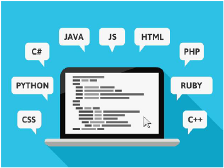

# cloud_foundations
Dive into foundational knowledge spanning cloud, data science and web development.

### Table of content
|chapter|Description|
|:-----:|:----------|
|[ch.01](#ch.01)| Introduction to computing |
|[ch.02](#ch.02)| Basic Computing Concepts |

###  ch. 01 - Introduction to Computing

*"Technology is not just a tool. It's a part of our lives and shapes our digital world every day."* 

-Jan Koum, co-founder of WhatsApp.

 
In today's world, we can use technology to extend our activities beyond physical, geographical and time limits. 
 
**Basic computing terminology**
- An application is a set of instructions that runs on a computer to perform a specific task.
- A computer program is written code in a programming language.
- Computer programs are generally called software.

**Type of applications**
*Application run on different types of devices and are accessed in different ways.*
- Web application; Runs in a `web server` or `application server` and is accessed from a web browser
- Mobile app; Runs in and is accessed from a `mobile device`
- Desktop application; Runs in and is accessed from a `desktop computer`
- Internet of Things (IoT) application; Runs in and is accessed from an appliance or `specialized device that is connected to the internet`

**Components inside a computer**
*Hardware*
- Motherboard
- Central Processing Unit (CPU)
- Memory / Random Access Memory (RAM)
- Storage Drive
- Network Card
- Graphic Card
- Power Supply

*Software*
- Operating System (OS)
- Application

In summary, applications, computer and networks run the digital world. An application is a computer program. It is a set of instruction that a computer runs to perform a specific task. A computer's hardware consits of its physical components (as mentioned above) and the software consists of the program that run on it (as mentioned above).

###  ch. 02 - Basic Computing Concepts

**Servers and data centers**

What is a server? A server serves as a specialized computer designed to furnish data or services to other computer across a network. Its fundamental role is to respond to requests initiated by client computers, facilitating seamless communication and data exchange. Distinguished by its hardware specifications, servers typically feature expanded memory capacity and support for multiple CPUs, enabling them to handle substantial workloads efficiently. Moreover, they incorporate redundancy mechanism such as duplicate power supplies and network interfaces to ensure continuous operation. Often compact in design, servers are optimized for rack-mounted deployment in data centers. Examples of servers types span various functions, including web servers for hosting websites, database servers for managing data storage and retrieval, and mail servers for facilitating email communication. These exemplify the divers roles serves fulfill in enabling and enhancing networked computing environments.

